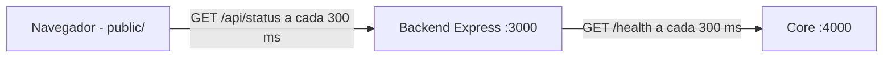

# Planejamento

## Objetivo
Mostrar, em uma página web, se um servidor está online (bandeira verde) ou offline (bandeira vermelha) e registrar o histórico de mudanças.

## Requisitos funcionais
- RF01: bandeira verde quando o core responde; vermelha quando não responde.
- RF02: o serviço é verificado a cada 0,3 s e o frontend atualiza na mesma cadência.
- RF03: histórico com data e hora completas e bolinha verde (online) ou vermelha (offline).
- RF04: o core é um servidor simples que pode ser ligado e derrubado à vontade.

## Requisitos não funcionais
- RNF01: tudo roda em containers Docker.
- RNF02: todo Pull Request passa por testes automáticos (GitHub Actions).
- RNF03: histórico em memória (últimos 100 eventos); banco de dados fica como evolução futura.

## Histórias de usuário
- Como avaliador, quero ver a bandeira mudar de cor quando derrubo o servidor, para confirmar que o monitor funciona.
- Como operador, quero um histórico com data e hora de cada queda e retorno, para saber quando o serviço falhou.

## Arquitetura

## Ciclo DevOps neste projeto
| Etapa | Como aparece no projeto |
|---|---|
| Planejar | Este documento, em `docs/`, versionado via Pull Request |
| Codar | Branches + Pull Requests no GitHub, código em `src/` e `public/` |
| Build | `Dockerfile` e `docker-compose.yml` |
| Testar | `npm test` (test/) e teste de fumaça no CI |
| Release | Workflow `release.yml` publica a imagem no GHCR ao criar uma tag `v*` |
| Deploy | `docker compose up -d` (Codespaces ou qualquer máquina com Docker) |
| Operar | `restart: unless-stopped` e derrubar/subir o core para simular falhas |
| Monitorar | O próprio produto + `healthcheck` do Docker + `docker compose logs` |

## Decisões
- O histórico guarda só mudanças de estado (não cada checagem), senão seriam ~200 linhas por minuto.
- Falha ou timeout de 250 ms na checagem conta como offline.
